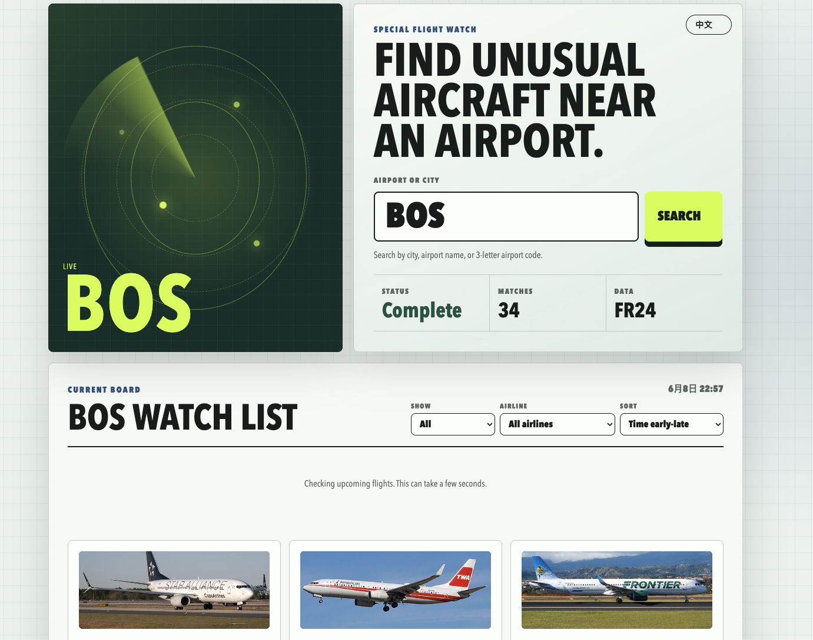
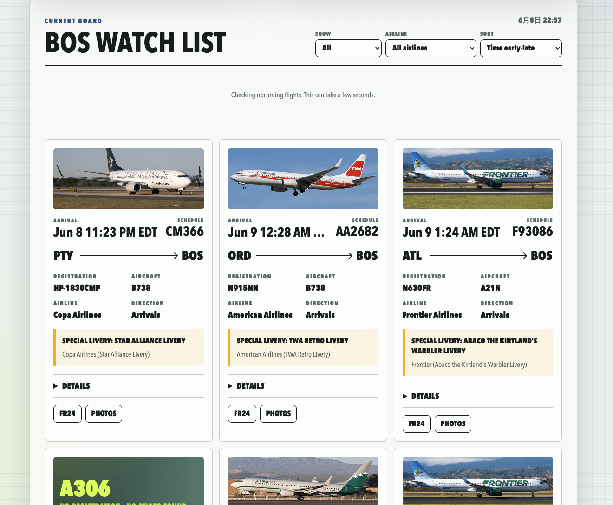

# Special Flight Alert

Scan airports for **special liveries**, **rare aircraft types**, and other noteworthy flights using [Flightradar24](https://www.flightradar24.com/) schedule data (via the community [FlightRadarAPI](https://github.com/JeanExtreme002/FlightRadarAPI) SDK).

This repo is designed as a **local-first** project: run the API and web UI on your Mac (or PC), use your home network IP to reach FR24, and keep secrets out of git.

**中文说明** → [README.zh-CN.md](README.zh-CN.md)

> **Disclaimer:** Personal and educational use only. Respect Flightradar24 [terms and conditions](https://www.flightradar24.com/terms-and-conditions). For commercial use, see the [official FR24 API](https://fr24api.flightradar24.com/).

---

## Features

Everything runs on your machine (or via GitHub Actions for scheduled scans). Home broadband works best with Flightradar24.

| Feature | What it does |
|---------|--------------|
| **Telegram push** | After each alert-engine scan: text digest + Excel snapshots (configure locally or in GitHub Actions secrets) |
| **Web UI** | Bilingual (EN/zh) search board — filter airlines, sort by time, browse special liveries with photos |
| **Cursor MCP** | Ask the AI in Cursor to scan an airport for you |
| **Alert engine (CLI)** | Score flights, export CSV/Excel, run on a schedule (`--loop`) |
| **HTTP API** | `GET /api/scan?airport=PVD` for scripts and the web UI |
| **GitHub Actions** | Scheduled **PVD** scans at Eastern 00:00 / 06:00 / 12:00 / 18:00, optional Telegram via repository secrets |

> **Notifications:** Telegram is supported. Email is not implemented in this repo.

---

## Screenshots

**Search** — pick an airport and scan for special flights.



**Results** — filter by airline, sort by time, and browse special liveries with photos.



---

## Install

**Requirements:** Python 3.10+

```bash
git clone https://github.com/LYL55555/special-flight-alert.git
cd special-flight-alert

# From repo root — not alert_engine/
pip install -r requirements.txt

# Optional: Cursor MCP
pip install -r mcp_server/requirements.txt
```

**Never commit real tokens.** Credentials go in `alert_engine/.env` (gitignored) or GitHub **Repository Secrets** for CI — not in source code.

---

## Telegram push

After each alert-engine run, the bot sends a **text digest** (new / expired / current special flights) and **Excel snapshot** attachments.

**Default airport:** **PVD** (including GitHub Actions in `.github/workflows/run.yml`). Use `--airports` to scan other codes locally.

### 1. Create a bot

1. Open Telegram and chat with [@BotFather](https://t.me/BotFather).
2. Send `/newbot`, follow the prompts, and copy the **bot token**.

### 2. Get your chat ID

1. Open a chat with your new bot and send `/start` (required — the bot cannot message you until you do).
2. In a browser, open:

   `https://api.telegram.org/bot<YOUR_TOKEN>/getUpdates`

   Replace `<YOUR_TOKEN>` with your real token.
3. In the JSON response, find `"chat":{"id":123456789}` — that number is your **chat ID**.

> Tip: [@userinfobot](https://t.me/userinfobot) can also show your numeric user ID.

#### Group / channel chat ID

If you want to send alerts to a Telegram group instead of a private chat:

1. Add the bot to the target group.
2. Send a message in the group, such as `/start` or `hello`.
3. Open:

   `https://api.telegram.org/bot<YOUR_TOKEN>/getUpdates`

4. Find the group / supergroup entry in the JSON response and copy its `"chat":{"id":...}` value.

Group chat IDs are usually negative numbers, for example:

```bash
TELEGRAM_CHAT_ID=-1001234567890
```

Note: [@userinfobot](https://t.me/userinfobot) usually returns your personal user ID, which may not work for group alerts. For group chats, prefer the `chat.id` returned by `getUpdates`.

### 3. Configure (local)

```bash
cp alert_engine/.env.example alert_engine/.env
```

Edit `alert_engine/.env`:

```bash
TELEGRAM_BOT_TOKEN=your_bot_token_here
TELEGRAM_CHAT_ID=your_chat_id_here
```

#### Security notes

- Do not hard-code `TELEGRAM_BOT_TOKEN` in source files.
- Do not commit `alert_engine/.env` to GitHub.
- Do not expose the bot token in screenshots, issues, or public chats.
- If the token leaks, regenerate it immediately via [@BotFather](https://t.me/BotFather).
- For GitHub Actions, store the token in **Repository Secrets**, not in workflow files.

### 4. Run a scan

```bash
cd alert_engine
python main.py --airports PVD
```

You should receive:

- A **digest message** listing flight changes since the last run
- **Excel files** attached (under `alert_engine/alert data/`)

### Optional: one message per alert

By default only the digest is sent. To also get a separate message for every qualifying flight (noisy on busy airports):

```bash
TELEGRAM_EACH_ALERT=1
```

Add that line to `alert_engine/.env`.

### Scheduled pushes (loop mode)

```bash
cd alert_engine
python main.py --loop --poll-seconds 14400 --airports PVD
```

`14400` = every 4 hours. Change airports in the command or in `alert_engine/config.py`.

### GitHub Actions (CI)

The workflow runs `python main.py --airports PVD` on a schedule. Add the same two variables under **Settings → Secrets and variables → Actions**:

- `TELEGRAM_BOT_TOKEN`
- `TELEGRAM_CHAT_ID`

You can also trigger a run manually from the **Actions** tab (`workflow_dispatch`).

> **Note:** GitHub Actions runs from cloud/datacenter IPs, which Flightradar24 / Cloudflare may block with 403 responses. So even if Telegram is configured correctly, scheduled CI runs may send empty or degraded results. This is not a Telegram setup issue. Local residential-network runs, or a local API exposed through a tunnel, are usually more reliable.

---

## Web UI

```bash
./scripts/run_demo.sh
```

Opens API on **:8000** and the web UI on **:8080**. Browse to **http://127.0.0.1:8080** and search **PVD**, **JFK**, or **LAX**. Press `Ctrl+C` to stop.

### Port already in use?

```bash
./scripts/stop_demo.sh   # frees 8000 / 8080, stops Docker stack if any
./scripts/run_demo.sh
```

### Web → API address

Default is in `web/config.js`:

```javascript
window.APP_CONFIG = {
  apiBaseUrl: "http://127.0.0.1:8000",
};
```

If the API runs on another port:

```bash
cp web/config.local.js.example web/config.local.js
# edit apiBaseUrl — config.local.js is gitignored
```

### API only (no web UI)

```bash
python3 -m uvicorn api.main:app --host 127.0.0.1 --port 8000
```

| URL | Purpose |
|-----|---------|
| http://127.0.0.1:8000/ | API info |
| http://127.0.0.1:8000/health | Health check |
| http://127.0.0.1:8000/docs | Swagger UI |
| http://127.0.0.1:8000/api/scan?airport=PVD | Scan airport |

---

## Cursor MCP

1. Install deps: `pip install -r mcp_server/requirements.txt` and `pip install -r requirements.txt`
2. Cursor loads `.cursor/mcp.json` automatically
3. In chat: *“Scan PVD for special flights using MCP”*

Tools: `scan_airport`, `health_check`

---

## Alert engine (CLI)

Background monitoring, CSV alerts, and Excel snapshots (pairs with [Telegram push](#telegram-push) above):

```bash
cd alert_engine
python main.py --airports PVD          # one-shot schedule scan
python main.py --live --airports PVD   # live radius mode
python main.py --loop --poll-seconds 14400
python main.py --help
```

Tune airports, scores, and horizons in `alert_engine/config.py`.  
Special liveries database: `alert_engine/db/special_liveries.csv`.

---

## API behavior notes

- Successful scans return flight JSON with `count`, `flights`, etc.
- If Flightradar24 is unreachable, `/api/scan` returns **HTTP 200** with `status: "degraded"` (not 502) so the UI stays usable.
- Works best on a **residential network**. Datacenter hosts (Render, GitHub Actions runners) are often blocked by FR24/Cloudflare — that is why this project defaults to **local** execution.

---

## Project layout

```
special-flight-alert/
├── api/                 # FastAPI HTTP API
├── alert_engine/        # CLI alert bot + scoring engine
├── web/                 # Static frontend
├── python/              # Vendored FlightRadarAPI SDK
├── mcp_server/          # Cursor MCP
├── img/                 # README screenshots
├── scripts/
│   ├── install_deps.sh  # pip install helper
│   ├── run_demo.sh      # local API + web UI
│   └── stop_demo.sh     # free ports 8000/8080
├── requirements.txt     # install from repo root
└── tests/
```

---

## Development

```bash
pip install -r requirements.txt
python3 -m pytest tests/test_api_routes.py -q
```

---

## Acknowledgments

Built on **[FlightRadarAPI](https://github.com/JeanExtreme002/FlightRadarAPI)** (MIT). See `LICENSE`.
