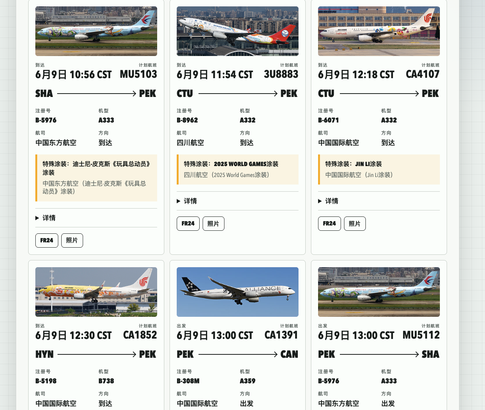

# Special Flight Alert（特殊航班观察）

通过 [Flightradar24](https://www.flightradar24.com/) 机场时刻表数据（社区 [FlightRadarAPI](https://github.com/JeanExtreme002/FlightRadarAPI) SDK），扫描你关心的机场，找出**特殊涂装**、**稀有机型**等值得关注的航班。

本项目以**完全本地运行**为主：API 和网页都在你自己电脑上跑，走家庭宽带 IP 访问 FR24，**不要把 Token 等凭证提交到 Git**。

**English** → [README.md](README.md)

> **免责声明：** 仅供个人学习使用。请遵守 Flightradar24 [服务条款](https://www.flightradar24.com/terms-and-conditions)。商业用途请使用 [官方 FR24 API](https://fr24api.flightradar24.com/)。

---

## 功能概览

所有模块都可以在本机运行；定时任务也可通过 GitHub Actions 在云端跑（家庭宽带访问 FR24 最稳定）。

| 功能 | 说明 |
|------|------|
| **Telegram 推送** | 每次扫描后发文字摘要 + Excel 快照（本地 `.env` 或 GitHub Secrets 配置） |
| **网页前端** | 中英文界面，按航司筛选、按时间排序，查看特殊涂装与飞机照片 |
| **Cursor MCP** | 在 Cursor 里让 AI 直接扫描机场 |
| **告警引擎（CLI）** | 航班评分、CSV/Excel 导出、定时循环扫描（`--loop`） |
| **HTTP API** | `GET /api/scan?airport=PVD`，供网页和脚本调用 |
| **GitHub Actions** | 定时扫描 **PVD**（美东 00:00 / 06:00 / 12:00 / 18:00），可选 Telegram 推送 |

> **通知方式：** 目前支持 Telegram，尚未实现邮件推送。

---

## 界面预览

**搜索页** — 选择机场，扫描特殊航班。


**结果列表** — 按航司筛选、按时间排序，查看特殊涂装与飞机照片。



---

## 安装

**环境要求：** Python 3.10+

```bash
git clone https://github.com/LYL55555/special-flight-alert.git
cd special-flight-alert

# 在仓库根目录执行，不要进 alert_engine 装
pip install -r requirements.txt

# 可选：Cursor MCP
pip install -r mcp_server/requirements.txt
```

**切勿把真实 Token 提交到 GitHub。** 凭证写在 `alert_engine/.env`（已 gitignore），或 GitHub **Repository Secrets**（CI 用），不要写进代码。

---

## Telegram 推送

每次告警引擎扫描结束后，Bot 会发送**文字摘要**（新增 / 过期 / 当前特殊航班）和 **Excel 快照附件**。

**默认机场：** **PVD**（GitHub Actions 工作流 `.github/workflows/run.yml` 同样扫描 PVD）。本地可用 `--airports` 指定其他机场。

### 1. 创建 Bot

1. 打开 Telegram，找到 [@BotFather](https://t.me/BotFather)。
2. 发送 `/newbot`，按提示操作，记下返回的 **bot token**。

### 2. 获取 chat ID

1. 找到你刚创建的 Bot，发送 `/start`（**必须先发**，否则 Bot 无法给你发消息）。
2. 在浏览器打开：

   `https://api.telegram.org/bot<你的TOKEN>/getUpdates`

   把 `<你的TOKEN>` 换成真实 token。
3. 在返回的 JSON 里找到 `"chat":{"id":123456789}`，这个数字就是 **chat ID**。

> 提示：也可以用 [@userinfobot](https://t.me/userinfobot) 查看你的数字用户 ID。

#### 群聊 / 频道 chat ID

如果你想把告警推送到 Telegram 群聊，而不是私聊：

1. 把 bot 加入目标群聊。
2. 在群里发送一条消息，例如 `/start` 或 `hello`。
3. 再打开：

   `https://api.telegram.org/bot<你的TOKEN>/getUpdates`

4. 在返回 JSON 里找到对应群聊的 `"chat":{"id":...}`。

群聊的 chat_id 通常是负数，例如：

```bash
TELEGRAM_CHAT_ID=-1001234567890
```

注意：[@userinfobot](https://t.me/userinfobot) 通常只能拿到你的个人 user ID，不一定适用于群聊。群聊推送请优先使用 `getUpdates` 里返回的 group / supergroup chat id。

### 3. 本地配置

```bash
cp alert_engine/.env.example alert_engine/.env
```

编辑 `alert_engine/.env`：

```bash
TELEGRAM_BOT_TOKEN=你的_bot_token
TELEGRAM_CHAT_ID=你的_chat_id
```

#### 安全提醒

- 不要把 `TELEGRAM_BOT_TOKEN` 写进代码。
- 不要把 `alert_engine/.env` 提交到 GitHub。
- 不要在截图、issue、公开聊天里暴露 bot token。
- 如果 token 泄露，请立刻去 [@BotFather](https://t.me/BotFather) 重新生成 token。
- GitHub Actions 使用的 token 应该放在 **Repository Secrets**，而不是写进 workflow 文件。

### 4. 跑一次扫描

```bash
cd alert_engine
python main.py --airports PVD
```

正常情况下你会收到：

- **摘要消息** — 与上次扫描相比的航班变化
- **Excel 附件** — 保存在 `alert_engine/alert data/`

### 可选：每条告警单独推送

默认只发摘要。若希望每条命中航班都单独来一条消息（繁忙机场会很吵），在 `.env` 里加上：

```bash
TELEGRAM_EACH_ALERT=1
```

### 定时推送（循环模式）

```bash
cd alert_engine
python main.py --loop --poll-seconds 14400 --airports PVD
```

`14400` 表示每 4 小时一次。机场可在命令行指定，或在 `alert_engine/config.py` 里改默认列表。

### GitHub Actions（CI）

工作流执行 `python main.py --airports PVD`。在仓库 **Settings → Secrets and variables → Actions** 添加：

- `TELEGRAM_BOT_TOKEN`
- `TELEGRAM_CHAT_ID`

也可在 **Actions** 页手动触发（`workflow_dispatch`）。

> **注意：** GitHub Actions 运行在云端数据中心 IP 上，Flightradar24 / Cloudflare 可能会返回 403。因此 GitHub Actions 即使 Telegram 配置正确，也可能只推送空结果或 `degraded` 状态。这不是 Telegram 配置错误，而是 FR24 对云端 IP 的限制。本地家庭网络或通过本机 tunnel 运行通常更稳定。

---

## 网页前端

```bash
./scripts/run_demo.sh
```

启动 API（8000 端口）和网页（8080 端口）。浏览器打开 **http://127.0.0.1:8080**，搜索 **PVD**、**JFK** 或 **LAX**。按 `Ctrl+C` 停止。

### 端口被占用？

```bash
./scripts/stop_demo.sh   # 释放 8000 / 8080，顺带停掉 Docker
./scripts/run_demo.sh
```

### 网页如何连 API

默认配置在 `web/config.js`：

```javascript
window.APP_CONFIG = {
  apiBaseUrl: "http://127.0.0.1:8000",
};
```

如果 API 跑在其他端口：

```bash
cp web/config.local.js.example web/config.local.js
# 修改 apiBaseUrl（此文件不会进 Git）
```

### 只启动 API（不要网页）

```bash
python3 -m uvicorn api.main:app --host 127.0.0.1 --port 8000
```

| 地址 | 用途 |
|------|------|
| http://127.0.0.1:8000/ | API 信息 |
| http://127.0.0.1:8000/health | 健康检查 |
| http://127.0.0.1:8000/docs | 接口文档 |
| http://127.0.0.1:8000/api/scan?airport=PVD | 扫描机场 |

---

## Cursor MCP 用法

1. 安装：`pip install -r mcp_server/requirements.txt` 和 `pip install -r requirements.txt`
2. Cursor 会自动读取 `.cursor/mcp.json`
3. 在对话中说：「用 MCP 扫描 PVD 的特殊航班」

可用工具：`scan_airport`、`health_check`

---

## 告警引擎（命令行）

适合后台监控、导出 CSV/Excel（配合上方 [Telegram 推送](#telegram-推送)）：

```bash
cd alert_engine
python main.py --airports PVD          # 单次扫描未来时刻表
python main.py --live --airports PVD   # 实时半径模式
python main.py --loop --poll-seconds 14400
python main.py --help
```

机场列表、评分阈值等在 `alert_engine/config.py` 里调整。  
特殊涂装数据库：`alert_engine/db/special_liveries.csv`。

---

## API 行为说明

- 扫描成功：返回 `count`、`flights` 等字段
- FR24 暂时不可用：返回 **HTTP 200** + `status: "degraded"`（不是 502），网页会提示「实时数据暂时不可用」
- **家庭网络**下数据最稳定；数据中心 IP（Render、GitHub Actions 等）常被 FR24/Cloudflare 拦截，因此项目默认**本地运行**

---

## 目录结构

```
special-flight-alert/
├── api/                 # FastAPI 后端
├── alert_engine/        # 命令行告警引擎
├── web/                 # 静态前端
├── python/              # 内置 FlightRadarAPI SDK
├── mcp_server/          # Cursor MCP
├── img/                 # README 截图
├── scripts/
│   ├── install_deps.sh  # 安装依赖
│   ├── run_demo.sh      # 本地一键 Demo
│   └── stop_demo.sh     # 释放端口
├── requirements.txt     # 根目录 pip install
└── tests/
```

---

## 开发

```bash
pip install -r requirements.txt
python3 -m pytest tests/test_api_routes.py -q
```

---

## 致谢

基于 **[FlightRadarAPI](https://github.com/JeanExtreme002/FlightRadarAPI)**（MIT），详见 `LICENSE`。
